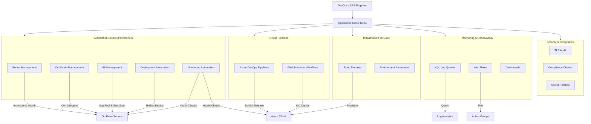

# DevOps & SRE Operations Toolkit


A production-grade operations toolkit demonstrating the core job duties of a **DevOps & Site Reliability Engineer** — infrastructure automation, CI/CD pipeline design, server fleet management, monitoring, incident response, security compliance, and release orchestration across hybrid (on-prem + cloud) environments.

---

## Table of Contents

- [Job Duties Demonstrated](#job-duties-demonstrated)
- [Architecture](#architecture)
- [Repository Structure](#repository-structure)
- [Tech Stack](#tech-stack)
- [Automation Scripts](#automation-scripts)
- [CI/CD Pipelines](#cicd-pipelines)
- [Infrastructure as Code](#infrastructure-as-code)
- [Monitoring & Observability](#monitoring--observability)
- [Security & Compliance](#security--compliance)
- [Documentation](#documentation)
- [Getting Started](#getting-started)
- [Related Projects](#related-projects)
- [License](#license)

---

## Job Duties Demonstrated

| Duty | Artifacts |
|---|---|
| **Infrastructure Provisioning & Management** | Bicep modules, server inventory scripts, fleet health checks |
| **CI/CD Pipeline Design & Automation** | Azure DevOps + GitHub Actions templates for .NET, IIS, and Kubernetes |
| **Server & Application Fleet Management** | Rolling restarts, app pool recycling, disk space monitoring |
| **Release & Deployment Orchestration** | Multi-stage deploy pipelines with approval gates and rollback |
| **Monitoring, Alerting & Incident Response** | KQL queries, alert rules, health-check automation, on-call runbooks |
| **Certificate & Secret Management** | Expiry scanning, automated renewal, Key Vault integration |
| **Security & Compliance Automation** | TLS audit, firewall rule validation, compliance reporting |
| **Configuration Management** | DSC-style server provisioning, IIS site/app pool configuration |
| **Capacity Planning & Cost Optimization** | Resource utilization reporting, right-sizing recommendations |
| **Documentation & Knowledge Sharing** | Runbooks, architecture diagrams, onboarding guides |

See [docs/job-duties-mapping.md](docs/job-duties-mapping.md) for the detailed mapping of every artifact to a specific job duty.

---

## Architecture



---

## Repository Structure

```text
devops-sre-operations-toolkit/
├── automation/
│   ├── server-management/
│   │   ├── Get-ServerInventory.ps1         # Fleet inventory with OS, role, components
│   │   ├── Invoke-RollingRestart.ps1       # Zero-downtime rolling IIS/service restarts
│   │   └── Test-ServerHealth.ps1           # Multi-check server health validation
│   ├── certificate-management/
│   │   ├── Get-ExpiringCertificates.ps1    # Scan fleet for certs expiring within N days
│   │   └── Install-Certificate.ps1         # Remote cert installation with binding
│   ├── iis-management/
│   │   ├── Get-AppPoolStatus.ps1           # App pool state across server fleet
│   │   └── Invoke-AppPoolRecycle.ps1       # Safe app pool recycle with drain
│   ├── deployment/
│   │   ├── Deploy-Application.ps1          # Scripted application deployment
│   │   └── Invoke-HealthCheckAfterDeploy.ps1 # Post-deploy smoke tests
│   └── monitoring/
│       ├── Test-EndpointHealth.ps1          # HTTP(S) endpoint health checker
│       └── Get-DiskSpaceReport.ps1          # Disk utilization with threshold alerts
├── pipelines/
│   ├── azure-devops/
│   │   ├── build-dotnet.yml                # .NET build + test + artifact publish
│   │   ├── deploy-iis.yml                  # Multi-stage IIS deploy with approvals
│   │   └── deploy-kubernetes.yml           # AKS Helm deploy with canary strategy
│   └── github-actions/
│       ├── build-container.yml             # Container build, scan, push to ACR
│       └── deploy-infra.yml                # Bicep deployment with OIDC auth
├── infra/
│   └── bicep/
│       ├── main.bicep                      # Orchestrator module
│       ├── modules/
│       │   ├── app-service.bicep           # App Service + Plan
│       │   ├── key-vault.bicep             # Key Vault with RBAC
│       │   ├── sql-database.bicep          # Azure SQL with auditing
│       │   └── log-analytics.bicep         # Log Analytics workspace
│       └── params/
│           ├── dev.bicepparam              # Dev parameters
│           └── prod.bicepparam             # Prod parameters
├── monitoring/
│   ├── alert-rules/
│   │   ├── availability-alerts.bicep       # Availability alert rules (Bicep)
│   │   └── performance-alerts.bicep        # CPU, memory, response time alerts
│   ├── dashboards/
│   │   └── operations-overview.json        # Azure Dashboard definition
│   └── log-queries/
│       ├── error-analysis.kql              # Application error investigation
│       ├── performance-baseline.kql        # Performance trending
│       └── deployment-correlation.kql      # Correlate deploys with error spikes
├── security/
│   ├── Invoke-TlsAudit.ps1                # TLS version and cipher audit
│   ├── Test-ComplianceBaseline.ps1         # Server compliance validation
│   └── Invoke-SecretRotation.ps1           # Key Vault secret rotation
├── docs/
│   ├── job-duties-mapping.md               # Every artifact mapped to a job duty
│   ├── architecture.md                     # Architecture and design decisions
│   ├── onboarding-guide.md                 # New engineer onboarding
│   └── resume-bullets.md                   # Portfolio summary
├── .github/
│   └── workflows/
│       ├── validate-scripts.yml            # PSScriptAnalyzer + Pester
│       └── validate-bicep.yml              # Bicep lint + validate
├── .gitignore
├── LICENSE
└── README.md
```

---

## Tech Stack

| Category | Technologies |
|---|---|
| Cloud Platform | Microsoft Azure |
| Infrastructure as Code | Azure Bicep |
| CI/CD | Azure DevOps Pipelines, GitHub Actions |
| Automation | PowerShell 7, Bash |
| Container Orchestration | Azure Kubernetes Service (AKS), Helm |
| Application Platform | IIS, .NET 8, Windows Server |
| Secrets Management | Azure Key Vault |
| Monitoring | Azure Monitor, Log Analytics, KQL |
| Security | TLS auditing, compliance baselines, secret rotation |
| Source Control | Git, GitHub |

---

## Automation Scripts

### Server Management

| Script | Purpose |
|---|---|
| [`Get-ServerInventory.ps1`](automation/server-management/Get-ServerInventory.ps1) | Query server fleet metadata, map servers to applications, export to Excel |
| [`Invoke-RollingRestart.ps1`](automation/server-management/Invoke-RollingRestart.ps1) | Rolling IIS restart across a server group with health-check gates |
| [`Test-ServerHealth.ps1`](automation/server-management/Test-ServerHealth.ps1) | Multi-point health check: ping, disk, services, certs, IIS |

### Certificate Management

| Script | Purpose |
|---|---|
| [`Get-ExpiringCertificates.ps1`](automation/certificate-management/Get-ExpiringCertificates.ps1) | Scan servers for certificates expiring within a threshold |
| [`Install-Certificate.ps1`](automation/certificate-management/Install-Certificate.ps1) | Install PFX certificate and bind to IIS site remotely |

### IIS Management

| Script | Purpose |
|---|---|
| [`Get-AppPoolStatus.ps1`](automation/iis-management/Get-AppPoolStatus.ps1) | Report app pool state across a fleet of IIS servers |
| [`Invoke-AppPoolRecycle.ps1`](automation/iis-management/Invoke-AppPoolRecycle.ps1) | Recycle app pools with connection drain and health verification |

### Deployment

| Script | Purpose |
|---|---|
| [`Deploy-Application.ps1`](automation/deployment/Deploy-Application.ps1) | Scripted deploy: stop site → copy bits → start site → verify |
| [`Invoke-HealthCheckAfterDeploy.ps1`](automation/deployment/Invoke-HealthCheckAfterDeploy.ps1) | Post-deployment HTTP smoke tests with retry logic |

### Monitoring

| Script | Purpose |
|---|---|
| [`Test-EndpointHealth.ps1`](automation/monitoring/Test-EndpointHealth.ps1) | HTTP(S) health check with response time and status tracking |
| [`Get-DiskSpaceReport.ps1`](automation/monitoring/Get-DiskSpaceReport.ps1) | Disk utilization report with configurable warning/critical thresholds |

---

## CI/CD Pipelines

### Azure DevOps

| Pipeline | Purpose |
|---|---|
| [`build-dotnet.yml`](pipelines/azure-devops/build-dotnet.yml) | Build, test, and publish .NET application artifacts |
| [`deploy-iis.yml`](pipelines/azure-devops/deploy-iis.yml) | Multi-stage IIS deployment with manual approval gates |
| [`deploy-kubernetes.yml`](pipelines/azure-devops/deploy-kubernetes.yml) | AKS deployment using Helm with canary rollout |

### GitHub Actions

| Workflow | Purpose |
|---|---|
| [`build-container.yml`](pipelines/github-actions/build-container.yml) | Build container image, run security scan, push to ACR |
| [`deploy-infra.yml`](pipelines/github-actions/deploy-infra.yml) | Deploy Bicep infrastructure with OIDC authentication |

---

## Infrastructure as Code

| Module | Resources Provisioned |
|---|---|
| [`main.bicep`](infra/bicep/main.bicep) | Orchestrator — coordinates all module deployments |
| [`app-service.bicep`](infra/bicep/modules/app-service.bicep) | App Service + App Service Plan with deployment slots |
| [`key-vault.bicep`](infra/bicep/modules/key-vault.bicep) | Key Vault with RBAC, soft delete, purge protection |
| [`sql-database.bicep`](infra/bicep/modules/sql-database.bicep) | Azure SQL Server + Database with auditing |
| [`log-analytics.bicep`](infra/bicep/modules/log-analytics.bicep) | Log Analytics workspace for centralized monitoring |

---

## Monitoring & Observability

| Artifact | Purpose |
|---|---|
| [`availability-alerts.bicep`](monitoring/alert-rules/availability-alerts.bicep) | Metric alerts for endpoint availability and uptime |
| [`performance-alerts.bicep`](monitoring/alert-rules/performance-alerts.bicep) | CPU, memory, and response time threshold alerts |
| [`operations-overview.json`](monitoring/dashboards/operations-overview.json) | Azure Portal dashboard with key operational metrics |
| [`error-analysis.kql`](monitoring/log-queries/error-analysis.kql) | KQL queries for error investigation and trending |
| [`performance-baseline.kql`](monitoring/log-queries/performance-baseline.kql) | Performance percentile analysis over time |
| [`deployment-correlation.kql`](monitoring/log-queries/deployment-correlation.kql) | Correlate deployment events with error rate changes |

---

## Security & Compliance

| Script | Purpose |
|---|---|
| [`Invoke-TlsAudit.ps1`](security/Invoke-TlsAudit.ps1) | Audit TLS versions and cipher suites on server fleet |
| [`Test-ComplianceBaseline.ps1`](security/Test-ComplianceBaseline.ps1) | Validate servers against security baseline (services, firewall, patches) |
| [`Invoke-SecretRotation.ps1`](security/Invoke-SecretRotation.ps1) | Rotate secrets in Azure Key Vault with zero-downtime |

---

## Getting Started

### Prerequisites

- PowerShell 7+
- Azure CLI (`az`)
- Azure Bicep CLI
- Git

### Clone and explore

```bash
git clone https://github.com/<your-username>/devops-sre-operations-toolkit.git
cd devops-sre-operations-toolkit
```

### Run a script locally

```powershell
# Check endpoint health
.\automation\monitoring\Test-EndpointHealth.ps1 -Url "https://your-app.azurewebsites.net/health"

# Scan for expiring certificates
.\automation\certificate-management\Get-ExpiringCertificates.ps1 -ComputerName "WEB-SERVER-01" -DaysUntilExpiry 30

# Disk space report
.\automation\monitoring\Get-DiskSpaceReport.ps1 -ComputerName "APP-SERVER-01","APP-SERVER-02"
```

### Validate Bicep templates

```bash
az bicep lint --file infra/bicep/main.bicep
az deployment group what-if \
  --resource-group rg-ops-dev \
  --template-file infra/bicep/main.bicep \
  --parameters infra/bicep/params/dev.bicepparam
```

---

## Documentation

- [Job Duties Mapping](docs/job-duties-mapping.md) — every artifact linked to a DevOps/SRE responsibility
- [Architecture](docs/architecture.md) — architecture diagrams and design decisions
- [Onboarding Guide](docs/onboarding-guide.md) — new team member onboarding
- [Resume Bullets](docs/resume-bullets.md) — portfolio summary for this project

---

## Related Projects

| Project | Focus |
|---|---|
| [aks-platform-bicep-github-actions](https://github.com/<your-username>/aks-platform-bicep-github-actions) | AKS infrastructure provisioning with Bicep and GitHub Actions |
| [aks-sre-platform-lab](https://github.com/<your-username>/aks-sre-platform-lab) | Full SRE platform with observability, SLOs, and incident response |
| [sre-devops-handbook](https://github.com/<your-username>/sre-devops-handbook) | Runbooks, checklists, cheat sheets, and operational documentation |

---

## License

This project is licensed under the MIT License. See [LICENSE](LICENSE) for details.
