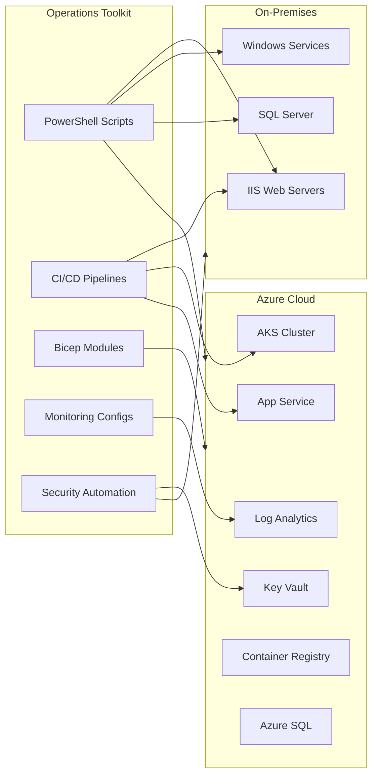

# Architecture

## Overview

This toolkit is organized around the core job duties of a DevOps & Site Reliability Engineer operating in a hybrid environment (on-premises Windows/IIS servers + Azure cloud).



## Design Principles

1. **Idempotent** — All scripts and IaC can be safely re-run without side effects
2. **Parameterized** — No hardcoded values; everything configurable via parameters
3. **Health-gated** — Deployments and restarts validate health before proceeding
4. **Auditable** — Actions produce structured output suitable for logging
5. **Incremental** — Bicep deployments use incremental mode to avoid destroying resources

## Component Layers

| Layer | Purpose | Technologies |
|---|---|---|
| **Automation** | Day-to-day operational tasks | PowerShell 7 |
| **CI/CD** | Build, test, deploy pipelines | Azure DevOps, GitHub Actions |
| **Infrastructure** | Resource provisioning | Azure Bicep |
| **Monitoring** | Observability and alerting | KQL, Azure Monitor, Bicep alerts |
| **Security** | Compliance and secret management | PowerShell, Key Vault |

## Environment Model

All pipelines follow a four-stage promotion model:

```
DV1 (Dev) → QA1 (Test) → SG1 (Staging) → RPRD (Production)
```

Each stage requires manual approval before promotion (except DV1 which deploys automatically on merge to main).
